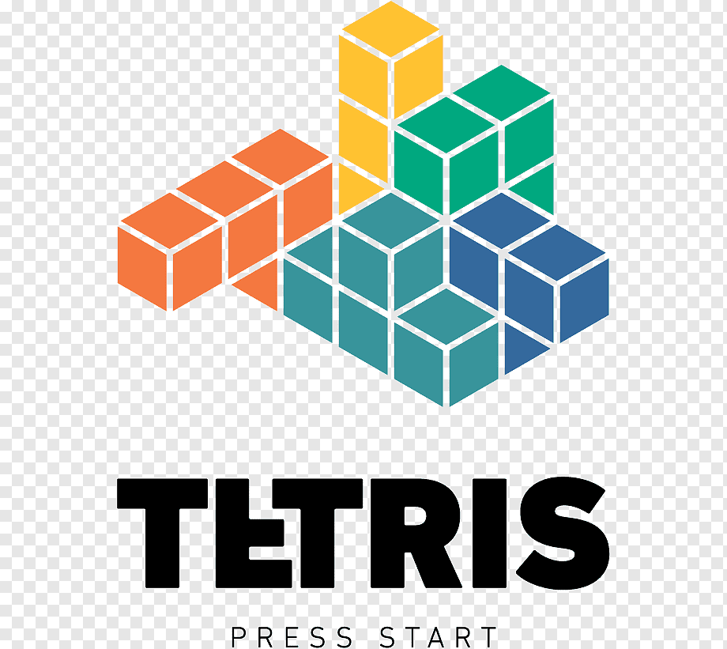
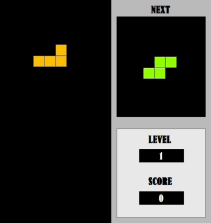

<!--- Shields --->

[![Contributors][contributors-shield]][contributors-url]
[![Forks][forks-shield]][forks-url]
[![Stargazers][stars-shield]][stars-url]
[![Issues][issues-shield]][issues-url]

<!-- project logo -->

 

  

  <h3 align="center">Tetris</h3>

  

    <a href="https://github.com/ilterissamur/Tetris"><strong>Explore the docs »</strong></a>
     
    <a href="https://github.com/ilterissamur/Tetris/issues">Report Bug</a>
    &nbsp;
    <a href="https://github.com/ilterissamur/Tetris/issues">Request Feature</a>
  

<h3>About the Project</h3>

The Tetris game project aims to replicate the classic gameplay experience while leveraging the features and capabilities offered by the .NET Framework and WinForms. The project involves designing the game's graphical user interface (GUI), implementing game mechanics such as piece movement and rotation, managing game state, and incorporating user input handling.

<h3>Gameplay</h3>

 

You can level up as you earn points, and as you level up, the falling speed of the blocks will increase. When you clear rows you can take points. If you clear more than one rown you can get extra points. Also you can get extra points by using down and space keys.

 

Right Key &nbsp; : Moves tetermino one unit right

Left Key &nbsp; : Moves tetermino one unit left

Down Key &nbsp; : Moves tetermino one unit down

Space Key &nbsp; : Brings tetermino down to the ground

<h3>Contact<h3>
<table width="100%">
   <tr>
      <td align="center">
          
         <a href="https://github.com/ilterissamur">İlteriş SAMUR</a> 
         <a href="https://github.com/ilterissamur"> </a>
         
          
         <a href="mailto:ilteris.samur@outlook.com">ilteris.samur@outlook.com</a>
      </td>
   </tr>
</table>

[contributors-shield]: https://img.shields.io/github/contributors/ilterissamur/Credit-Score-Prediction.svg?style=for-the-badge
[forks-shield]: https://img.shields.io/github/forks/ilterissamur/Credit-Score-Prediction.svg?style=for-the-badge
[stars-shield]: https://img.shields.io/github/stars/ilterissamur/Credit-Score-Prediction.svg?style=for-the-badge
[issues-shield]: https://img.shields.io/github/issues/ilterissamur/Credit-Score-Prediction.svg?style=for-the-badge

<!-- Links -->

[contributors-url]: https://github.com/ilterissamur/Credit-Score-Prediction/graphs/contributors
[forks-url]: https://github.com/ilterissamur/Credit-Score-Prediction/network/members
[stars-url]: https://github.com/ilterissamur/Credit-Score-Prediction/stargazers
[issues-url]: https://github.com/ilterissamur/Credit-Score-Prediction/issues
